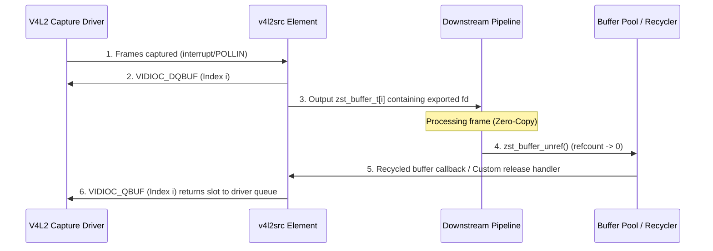

# V4L2 Source DMA-BUF Exporter Plan

This document outlines the design and implementation plan to extend the V4L2 source element (`v4l2src`) to support exporting driver-allocated MMAP buffers as DMA-BUFs using `VIDIOC_EXPBUF`.

This enables `v4l2src` to act as a **DMA-BUF exporter**, allowing downstream hardware-accelerated elements (e.g. video encoders, decoders, or display sinks) to consume captured frames with zero CPU copies.

---

## 1. Property Configuration

A new mode will be added to the `"memory-type"` property of `v4l2src`:

| Property Value | Driver Memory Mode | Role | Buffer Allocation Source |
|---|---|---|---|
| `"mmap"` | `V4L2_MEMORY_MMAP` | Copier / Inline | Allocated by driver, mapped by element, copied downstream. |
| `"userptr"` | `V4L2_MEMORY_USERPTR` | Importer | Allocated by application/upstream, imported to driver. |
| `"dmabuf"` | `V4L2_MEMORY_DMABUF` | Importer | Allocated by upstream (DMABUF), imported to driver. |
| `"mmap-export"` | `V4L2_MEMORY_MMAP` | **Exporter** | Allocated by driver, exported as DMA-BUF `fd` to downstream. |

---

## 2. Buffer Allocation & Export Sequence

When `"memory-type"` is configured as `"mmap-export"`, the startup sequence in `v4l2_start` will perform the following steps:

1. **Request MMAP Buffers:**
   Issue `VIDIOC_REQBUFS` to the V4L2 device with `req.memory = V4L2_MEMORY_MMAP`.

2. **Retrieve & Export Descriptors:**
   Allocate arrays to keep track of memory maps and file descriptors:
   * `s->buffers` for `mmap` mappings.
   * `s->exported_fds` (array of `int`) to store exported DMA-BUF file descriptors.
   * `s->pool_buffers` to store persistent `zst_buffer_t*` references.

   For each buffer index `i` (from `0` to `nb_buffers - 1`):
   * Call `VIDIOC_QUERYBUF` to retrieve the buffer size and offset.
   * Map user-space memory:
     ```c
     s->buffers[i].start = mmap(NULL, buf.length, PROT_READ | PROT_WRITE, MAP_SHARED, s->fd, buf.m.offset);
     ```
   * Export the buffer slot as a DMA-BUF file descriptor using `VIDIOC_EXPBUF`:
     ```c
     struct v4l2_exportbuffer expbuf = {0};
     expbuf.type = V4L2_BUF_TYPE_VIDEO_CAPTURE;
     expbuf.index = i;
     expbuf.flags = O_RDWR | O_CLOEXEC;
     if (ioctl(s->fd, VIDIOC_EXPBUF, &expbuf) < 0) {
         // Handle error
     }
     s->exported_fds[i] = expbuf.fd;
     ```

3. **Wrap in Pipeline Buffers:**
   For each slot, wrap the exported file descriptor in a persistent `zst_buffer_t`:
   * Set `buf->memory.type = ZST_MEMORY_DMABUF`.
   * Set `buf->memory.data = s->buffers[i].start`.
   * Set `buf->memory.size = s->buffers[i].length`.
   * Set `buf->memory.priv` to the address of the corresponding exported fd: `&s->exported_fds[i]`.
   * Bind a custom release function: `buf->memory.release = v4l2src_dmabuf_release_callback;`.

4. **Initialize Driver Queue:**
   Queue the buffer to the V4L2 driver using `ioctl(s->fd, VIDIOC_QBUF, &vbuf)` with `V4L2_MEMORY_MMAP`.

5. **Start Stream:**
   Call `ioctl(s->fd, VIDIOC_STREAMON, &type)`.

---

## 3. Buffer Lifecycle & Custom Recycling Flow

Because `v4l2src` passes its internal driver-allocated memory downstream, it cannot immediately re-queue a driver buffer slot in `v4l2_process()` after dequeuing it. Instead, the driver buffer slot must remain locked until all downstream elements have finished using the `zst_buffer_t`.

### Diagram:


### Callback Mechanism:
* To implement step 5 without altering the core `zst_buffer_pool_t` internal structures, the buffer's custom `memory.release` callback will be intercepted or structured:
  * When `zst_buffer_unref` reaches a reference count of 0, if `buf->pool` is configured, it goes back to the pool.
  * To hook recycling directly, we can define a custom release callback `v4l2src_dmabuf_release_callback` set on the buffer's memory structure. This callback receives a pointer to the buffer tracking context and uses `ioctl(s->fd, VIDIOC_QBUF, &qbuf)` to re-queue the specific buffer index back to the driver.

---

## 4. Resource Cleanup

During shutdown (`v4l2_stop` and `v4l2_close`):
1. Stop the video device stream via `VIDIOC_STREAMOFF`.
2. Unmap user-space mapping addresses for each buffer slot.
3. Close all exported DMA-BUF file descriptors:
   ```c
   for (uint32_t i = 0; i < s->nb_buffers; i++) {
       if (s->exported_fds[i] >= 0) {
           close(s->exported_fds[i]);
           s->exported_fds[i] = -1;
       }
   }
   ```
4. Free internal buffer tracking allocations.

---

## 5. Task Checklist

- [ ] Add `"mmap-export"` support to `"memory-type"` property validation and documentation.
- [ ] Add `exported_fds` tracking array to `v4l2_source_t` private struct.
- [ ] Implement `VIDIOC_EXPBUF` query logic inside the buffer setup loop in `v4l2_start()`.
- [ ] Implement custom buffer lifecycle recycling handler to return finished frames back to the driver queue.
- [ ] Update `v4l2_stop` and `v4l2_close` to safely close exported file descriptors.
- [ ] Implement unit tests validating exported DMABUF behavior using `v4l2loopback`.
